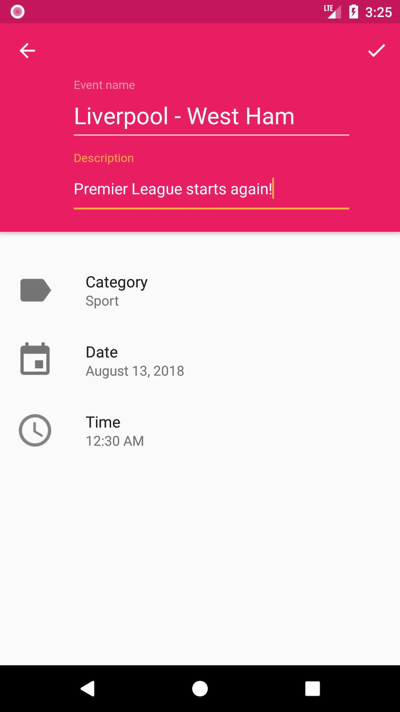
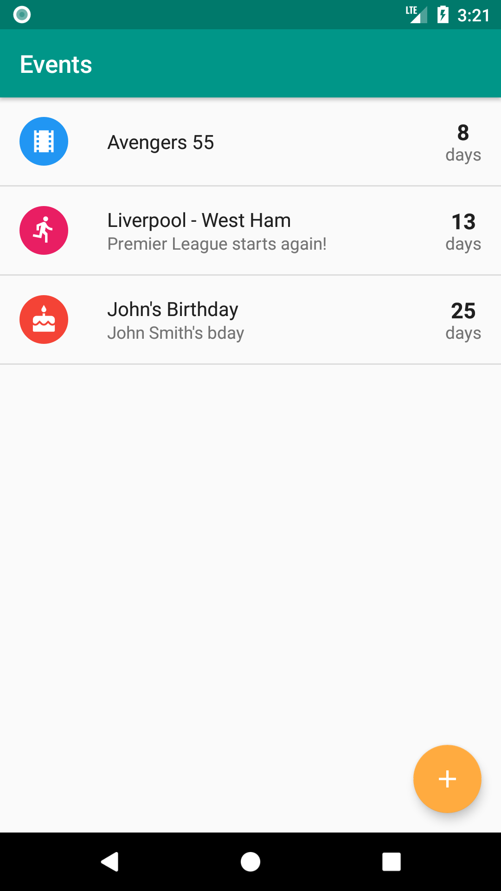
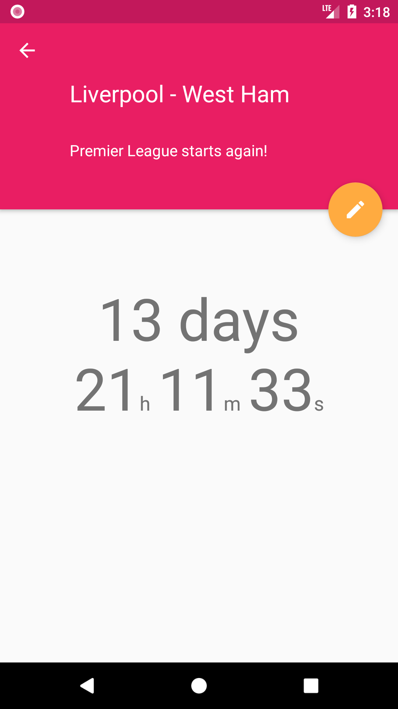

# MaterialCountdown
A free countdown app for Android designed with the Material Design guidelines in mind.

## Screenshots
  

Getting Started
---------------

This sample uses the Gradle build system. To build this project, use the
"gradlew build" command or use "Import Project" in Android Studio.

Pre-requisites
--------------

- Android SDK 27
- Android Build Tools v27.0.3
- Android Support Repository

License
-------

This application's source code is available under the [Apache 2.0](https://opensource.org/licenses/Apache-2.0) license.
